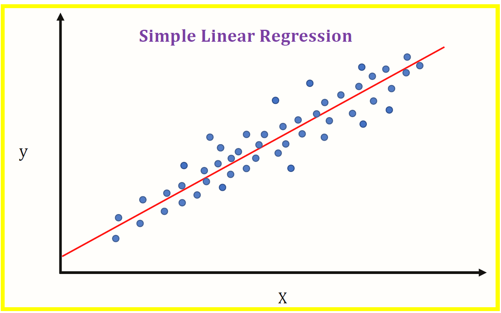

Repository for the codes of the [Supervised Machine Learning: Regression and Classification](https://www.coursera.org/learn/machine-learning?specialization=machine-learning-introduction) course by Andrew Ng.

# Week 1

Andrew introduces a very basic algorithm for linear regression using the Gradient Descent algorithm to learn. What that means is, if we have a labeled dataset $D = \\{(x^{(1)}, y^{(1)}), \ldots, (x^{(n)}, y^{(n)})\\}$, then this algorithm fits the best linear approximation to the points. The following image gives an example of what I'm talking about:

The algorithm works like this: a linear function can be defined as $f(w, b, x) = wx + b$, being $w$ and $b$ the parameters we want to learn to fit the dataset.
In order to learn, we define the following cost function that we want to minimize:
$$C(w, b) = \frac{1}{2|D|}\sum_{i=1}^{|D|} (f(w, b, x^{(i)}) - y^{(i)})^2.$$
Now, to minimize this function, we use the Gradient Descent algorithm, which basically says that, given some parameters $(w, b)$, the direction that minimizes the function $C(w, b)$ is given by $-\text{grad}C(w, b)$ and, therefore, the new point $(w_+, b_+) = (w, b) - \text{grad}C(w, b)$ is closer to the minimum of $C$.
There is a caveat to this formula, though.
In practice we update the point by doing $(w, b) - \alpha \cdot \text{grad}C(w, b)$, for $\alpha > 0$, because, although the gradient gives the right direction, it not necessarily gives the right size of the step.
Therefore, you have to choose $\alpha$ small or big according to the function you want to minimize.
$\alpha$ is called *learning rate* and in this case I hardcoded $\alpha = 0.35$, but there are more robust ways of finding $\alpha$ (see [here](https://en.wikipedia.org/wiki/Gradient_descent)).
The algorithm for a very simple dataset is in the directory *week_one*.